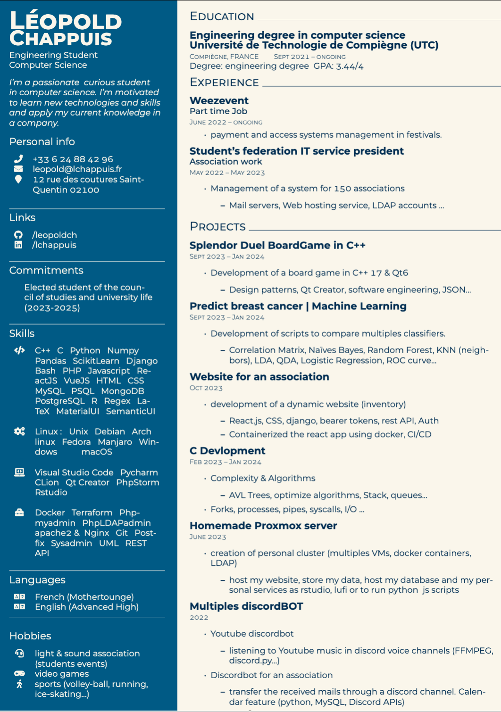

# resume
resume made with LaTeX 

# how to run 

- install the following package on osX : brew install texlive
- install the following package on Debian based distro : sudo apt-get install texlive-fonts-extra

# result 

